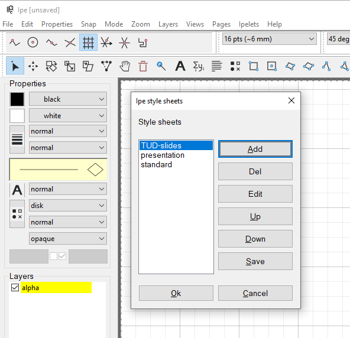
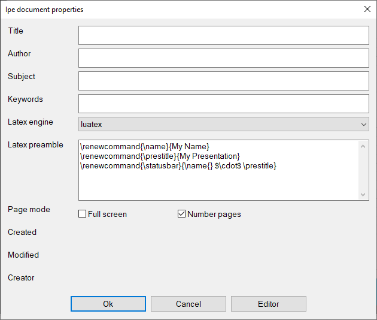

# TU Delft slides template for Ipe
Unofficial style sheet for [Ipe](https://ipe.otfried.org/) graphic editor for styling presentations in [TU Delft house style](https://www.tudelft.nl/huisstijl).

## Manual

Install the necessary fonts provided by [TU Delft](https://www.tudelft.nl/huisstijl/bouwstenen/typografie). 

To use the template, either edit in Ipe `TUD-slides-template.ipe` or `TUD-slides-template.pdf` file and modify according to your needs or:

1. create a new file in Ipe and add to its stylesheets `presentation.isy` (standard, delivered with Ipe) and `TUD-slides.isy`:
   

2. In Document properties, change Latex engine to lualatex, add and edit these three lines in Latex preamble:

   ```
   \renewcommand{\name}{My Name}
   \renewcommand{\prestitle}{My Presentation}
   \renewcommand{\statusbar}{\name{} $\cdot$ \prestitle}
   ```

   and turn on the page numbers

   

3. To create title page, use *Ipelets->Symbols->use symbol* and select there `Titlepage`
4. To switch off the footer colour band on some slide (*e.g.* on the title page) create there a layer named BACKGROUND.

Please see [this page](https://olejorik.github.io/post/ipe_presentation_template/) for instructions how to create such templates.
